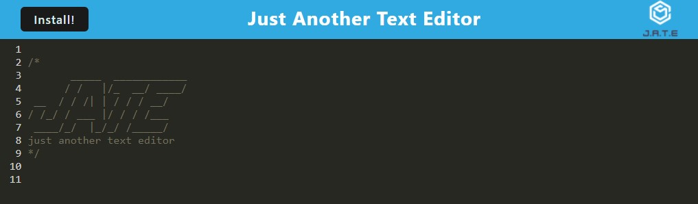

# J-A-T-E-1-2-3 (Just Another Text Editor)

---
## Table of Contents
* [Description](#description)
* [Application](#application)
* [Contributing](#contributing)
* [Tests](#tests)
* [Licence](#licence)
* [Questions](#questions)

---
## Description

Introducing a powerful text editor that runs directly in your browser, with full offline functionality and data redundancy. This single-page application is built with modern web technologies and meets the criteria for a Progressive Web App. With data persistence techniques using IndexedDB, you can rest assured that your work is always safe and accessible, even when offline. Deployed on Heroku, this app is available to you wherever and whenever you need it. Take your productivity to the next level with our browser-based text editor.

[BACK TO TOP](#top)

---
## Application

Application is Deployed [here](https://j-a-t-e-1-2-3.herokuapp.com/)

---
## Contributing
We welcome and encourage contributions from the community. If you are interested in contributing to this project, you can help by contributing code by forking the repository, making your changes, and submitting a pull request. Thank you for considering a contribution to this project!

[BACK TO TOP](#top)

---
## Tests
Test scripts were not included in this project.

[BACK TO TOP](#top)

---
## Licence
This project is licenced by MIT License

[BACK TO TOP](#top)

---
## Questions
Please visit my [GitHub Profile](https://github.com/teriannephillips)

[E-mail me](mailto:phillips.terianne@gmail.com) if you have any further questions!

[BACK TO TOP](#top)
